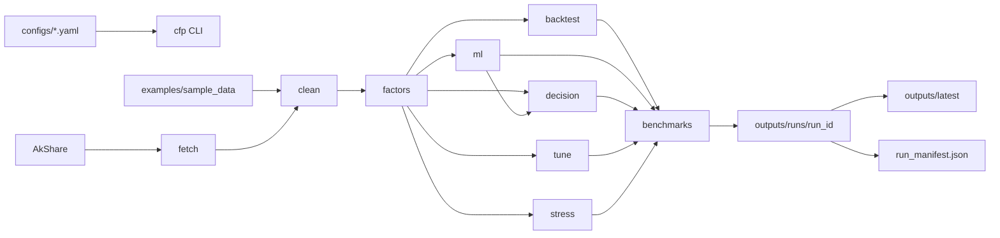

# Computational Finance Pipeline

[](https://github.com/993030293/computational-finance-pipeline/actions/workflows/ci.yml)

A reproducible Python pipeline for computational finance research. The project covers market-data ingestion, cleaning, factor construction, statistical validation, machine learning experiments, portfolio backtesting, decision-aware optimization, tuning, stress tests, and benchmark reporting.

The emphasis is engineering discipline: typed configuration, fail-fast CLI behavior, sample-data reproducibility, CI quality gates, versioned outputs, run manifests, atomic writes, and leakage-aware validation. Results are research diagnostics, not investment advice or live trading claims.

## Quickstart

Run the full pipeline on the public sample dataset:

```powershell
git clone https://github.com/993030293/computational-finance-pipeline.git
cd computational-finance-pipeline
python -m pip install -e ".[dev]"
python scripts/create_sample_data.py
cfp run-all --skip-fetch --config configs/sample.yaml
```

The command writes a versioned run to `outputs/runs/<run_id>/` and publishes a Windows-compatible latest copy to `outputs/latest/`.

## Pipeline



More detail:

- Architecture: [`docs/architecture.md`](docs/architecture.md)
- Stage I/O contract: [`docs/stage_io_contract.md`](docs/stage_io_contract.md)
- Data card: [`DATA_CARD.md`](DATA_CARD.md)
- Model card: [`MODEL_CARD.md`](MODEL_CARD.md)
- Resume/interview notes: [`docs/resume.md`](docs/resume.md)

## Stages

| Stage | Purpose | Main Outputs |
|---|---|---|
| `fetch` | AkShare data acquisition with cache, checkpoint/resume, rate limiting, and fetch report | `raw/`, `processed/`, `FETCH_REPORT.md` |
| `clean` | Column normalization, type coercion, duplicate checks, price sanity checks, technical indicators | `processed/daily_price_panel.csv`, `QUALITY_REPORT.md` |
| `factors` | Factor panel and statistical validation | `project4/factors.csv`, IC/decay/Fama-MacBeth summaries |
| `backtest` | Factor portfolio returns, costs, turnover, NAV, drawdown | `proj5_output/` |
| `ml` | Supervised learning with expanding or purged walk-forward validation | `ml/` |
| `decision` | Score-to-weight optimizer with risk, turnover, and concentration penalties | `decision/` |
| `tune` | Validation-only hyperparameter selection | `tuning/` |
| `stress` | Market mechanism sensitivity tests | `stress/` |
| `benchmarks` | Unified baseline registry and stability report | `benchmarks/` |

## Reproducibility

Every full run records:

- `resolved_config.yaml`: merged defaults plus config and CLI overrides.
- `run_manifest.json`: run id, command, git SHA, Python version, package version, stage status, input files, output files, and metric summaries.
- `outputs/LATEST_RUN.json`: pointer to the latest successful run.

Single-stage commands still support the legacy `outputs/latest` style path, while `cfp run-all` uses `outputs/runs/<run_id>/`.

## Commands

Run all stages with sample data:

```powershell
python scripts/create_sample_data.py
cfp run-all --skip-fetch --config configs/sample.yaml
```

Run selected stages:

```powershell
cfp clean --config configs/sample.yaml
cfp factors --config configs/sample.yaml
cfp backtest --config configs/sample.yaml
cfp ml --config configs/sample.yaml
cfp decision --config configs/sample.yaml
cfp tune --config configs/sample.yaml
cfp stress --config configs/sample.yaml
cfp benchmarks --config configs/sample.yaml
```

Run without installing the package:

```powershell
$env:PYTHONPATH = "src"
python -m cfpipeline run-all --skip-fetch --config configs/sample.yaml
```

## Local QA

```powershell
python -m ruff check .
python -m ruff format --check .
python -m mypy
python -m pytest --cov=cfpipeline --cov-report=term-missing --cov-fail-under=50
python scripts/create_sample_data.py
cfp run-all --skip-fetch --config configs/sample.yaml
```

Pre-commit:

```powershell
pre-commit install
pre-commit run --all-files
```

GitHub Actions runs Ruff, format check, mypy, pytest coverage, a Linux/Windows Python matrix, and a sample CLI smoke test.

## Data

- Full local data lives in `data/` and is ignored by git.
- Generated outputs live in `outputs/` and are ignored by git.
- Public sample data lives in `examples/sample_data/` for CI and clone-and-run demos.
- Market data fetched through AkShare or upstream providers may have separate usage and redistribution terms. See [`DATA_CARD.md`](DATA_CARD.md).

## Baseline Metrics

The repository may include research reports with historical baseline metrics from a migrated local dataset. These numbers are kept to document reproducibility and methodology. They should not be interpreted as deployable alpha, investment advice, or evidence of live trading performance.

For current sample or full-data results, inspect:

- `outputs/latest/proj5_output/performance_metrics.csv`
- `outputs/latest/proj5_output/performance_metrics_net.csv`
- `outputs/latest/benchmarks/benchmark_registry.csv`
- `outputs/latest/benchmarks/STABILITY_REPORT.md`

## Documentation

- Research report: [`reports/research_report.md`](reports/research_report.md)
- Related work adaptation: [`reports/related_work.md`](reports/related_work.md)
- Figures index: [`reports/FIGURES.md`](reports/FIGURES.md)
- Contributing guide: [`CONTRIBUTING.md`](CONTRIBUTING.md)
- License: [`LICENSE`](LICENSE)

## Limitations

- This is a research pipeline, not a production trading system.
- Snapshot stock universes can introduce survivorship bias unless historical constituents are supplied.
- Transaction costs and slippage are simplified basis-point assumptions.
- Stress tests approximate mechanisms such as liquidity, price limits, and T+1 delay; they are not a full exchange simulator.
- ML and factor relationships can be unstable across market regimes.
- Test metrics are reporting-only diagnostics and must not be used for hyperparameter selection.

## License

Source code is released under the MIT License. Data obtained from third-party providers may have separate terms.
