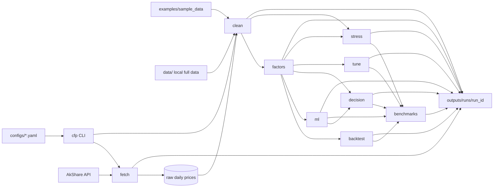
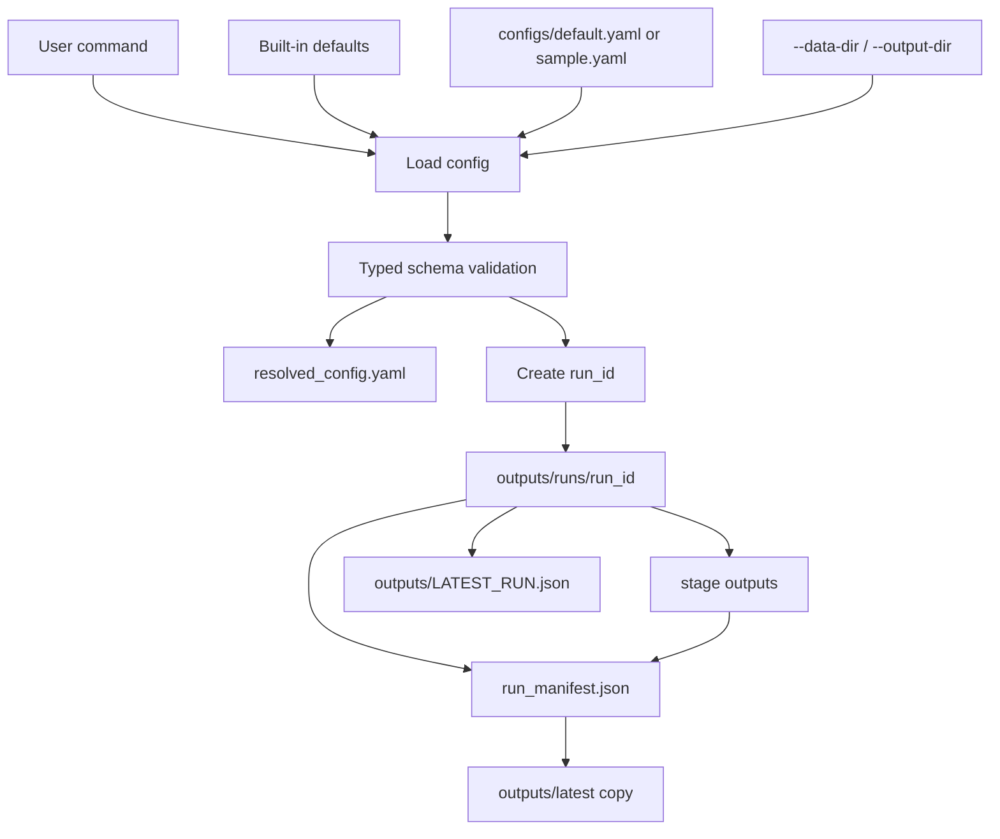

# Architecture

This project is organized as a reproducible research pipeline. The CLI is the public entry point, configs define run behavior, and every full `run-all` execution writes versioned artifacts plus a manifest.

## Pipeline Graph



## Config, Manifest, and Outputs



## Package Layout

```text
src/cfpipeline/
  acquire.py       fetch, cache, checkpoint, fetch report
  cleaning.py      data cleaning and technical indicators
  factors.py       factor construction and statistical validation
  backtest.py      portfolio returns, costs, NAV, performance
  ml.py            supervised learning with walk-forward validation
  decision.py      decision-aware portfolio optimization
  tuning.py        validation-only hyperparameter selection
  stress.py        market mechanism stress tests
  benchmarks.py    benchmark registry and stability report
  validation.py    expanding and purged walk-forward splits
  artifacts.py     atomic writes, run manifest, latest publishing
  config.py        typed config defaults and validation
  cli.py           cfp command-line interface
```

## Design Principles

- Keep all pipeline logic callable from Python and from the CLI.
- Make full runs reproducible through `resolved_config.yaml` and `run_manifest.json`.
- Keep generated data and large outputs out of git.
- Treat performance metrics as research diagnostics, not trading claims.
- Prefer explicit chronological validation over random train/test splits.
